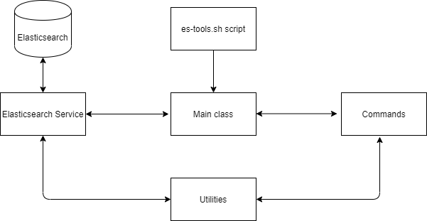

# Command-line tools for Elasticsearch
This application is a collection of command-line tools to query the Elasticsearch REST API.

This application was built during the last month of my coop term at CNW Cision Canada (winter term 2020, remote work due to the pandemic).

Two coop students contributed to this project. I was responsible for the parsing aspect of the project, enabling 
commands configuration and designing the project with scalability in mind.  
## Issue
Searching for data in Elasticsearch was tedious and prone to error as the data we have is a complex and we search data frequently especially for QA testing

## Solution
Create a command line application with configurable commands (source, number of returned results, returned fields...).
The requirements limited the minimum viable product to search operations.

## Implementation
The application was developed in Java using the JCommander library.
The application parses a command from the command line and then constructs a search query and executes it in order to get a search result from Elasticsearch.

The project consisted of an Elasticsearch service, a repository for commands classes and a repository for utility classes
dealing mainly with configuration files, and a script file to run the application 

The minimum viable product was supposed to support search queries only, and even though we only planned to implement a search command, we designed the tool in a way that makes it relatively easy to add more commands in the future.

The project was built with Gradle.

## Results
We managed to finish developing the minimum viable product by the last day of the coop term. 

The QA engineer was able to test it on the production environment and got search results back from the tool.

The team was very satisfied with the product.

## What I learned
I learned how to collaborate with other team members and come up with the design and implementation of the project.

We had to conduct spikes and present the research results to the team, organize design meetings to discuss our decisions, and divide the tasks so that everyone works on a particular aspect of the project.

We worked on this project from home as the office was closed because of the pandemic. 
