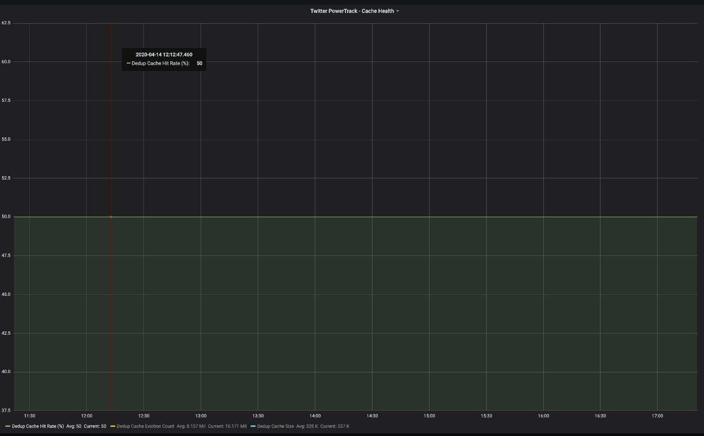
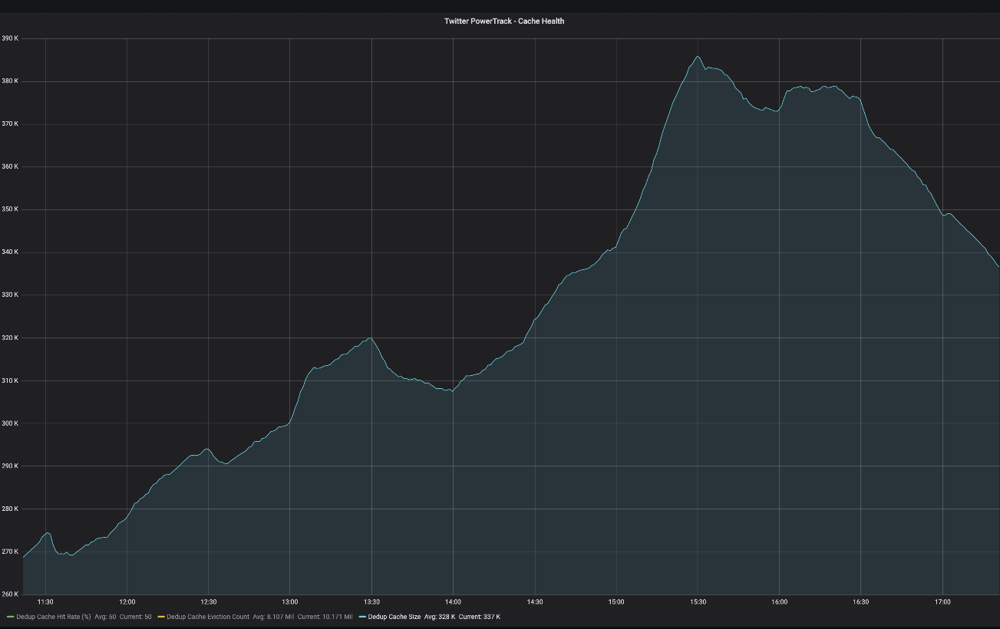

# In-Memory Cache for Data Pullers
I built this project during my coop term at CNW Cision Canada (winter term 2020).

## Issue
We had data retrievers that were doing data transformation while reading from the stream.
This resulted in the retrievers falling behind the stream and forced to disconnect, which resulted in data loss.
We had to find a way to make pulling data faster and separate data pulling from data transformation.

## Solution
The chosen solution for this problem was to create a puller that only pulls data from the stream without doing any data transformation,
 write the data to a queue, and then make the old retriever pull data from that queue.
 
As a measure of safety, two instances of the puller are to be used on different hosts in case one of them stopped working.
 
This is a good safety measure against data loss but will create duplicate data in the system, so we need a caching mechanism to prevent data duplicates.
 
I worked on the caching system, while a senior developer worked on the data pullers.

## Implementation

*Simplified ingestion design with two data pullers and deduplication cache*

I used the Guava caching library by Google as it is a lightweight in-memory caching library. The idea was that whenever we ask the retriever to provide the next available data, we check whether it is cached or not. 
If yes, then we know that the data has already been provided and thus the current data we have is a duplicate and we need to not return it. 
If no, then this is the first time the data is returned and so we need to return it.

The system consisted of a service that runs different types of retrievers based on the data type and source. 
The configuration for the service is provided via a configuration file. 
The differences in data types and their respective retrievers made the task challenging as there is no simple way to implement the caching mechanism.

I ended up solving the issue by creating a wrapper class that takes a data driver and enables caching for the wrapped driver. 
This solution provides a high degree of flexibility.

We also wanted to monitor the data of the cache to see how it is performing. 

The default stats returned by the cache were not useful for our case so I had to come up with some equations to make the returned stats more meaningful to us.  

The way the Guava cache works is that you can specify a max size for the cache and a time to live for the data. 
If a cached value was not hit during its time to live duration, it will be evicted. 
If the cache is full, the cache will evict the oldest cached values that have been hit the least. 

Using those stats, I decided to include the following metrics:

-	**Hit rate**: gives an idea on the percentage of articles that have been cached: the closer to 50% the better.  
-	**Cache size**: ((miss rate – eviction rate)*100/cache max size) gives an idea of how full the cache is.

**Example**:
-	**Hit rate of 50% and cache size of 70%**: all the duplicates of ingested valid data have been rejected with enough space left in the cache. From this example, we understand that the cause of eviction is the time-to-live parameter. The solution is to increase the lifetime of data in the cache.
-	**Hit rate of 50% and cache size of 100%**: all the duplicates of ingested valid data have been rejected but the cache is full. In this case, the cause of the eviction is the max size of the cache. The solution is to increase the size of the cache.
-	**Hit rate of 40% and cache size of 70%**: some of the duplicate data have passed with enough space left in the cache. This means that there is an issue with data ingestion, as some previously ingested data went through the cache and expires before its duplicate hits the cache.
-	**Hit rate of 40% and cache size of 100%**: some of the duplicate data have been rejected with not enough space in the cache. The issue in this case is caused by a high ingestion speed with a difference in write time between the pullers and a cache that is not able to keep up with the ingestion. Increasing the max size of the cache solves the problem, and investigation of the data ingestion is needed.

## Results
The data pullers that were added to the system were able to keep up with the stream. The caching mechanism was also able to do what it was built for, and the settings at which it was running were enough to keep it up with the pullers

*Cache hitrate evolution during data retreival from a stream*

*Cache size evolution during data retreival from a stream*

## What I learned
Working on this project introduced me to caching in general and in-memory caching in particular. 

I also learned how to design and implement metrics to track and measure the performance of your project. 

This project introduced me to peer programming with senior developers.
